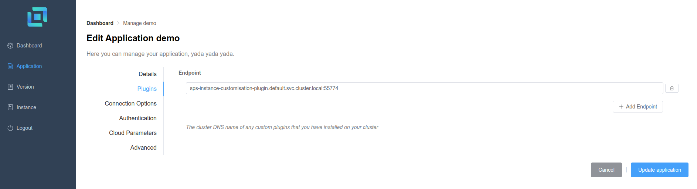

## Configuring your application

The **Application** running on Scalable Pixel Streaming needs to be told to use the instance customisation plugin. That is done by managing your Application via the Scalable Pixel Streaming Dashboard.

If you are not familiar with the Dashboard or how to access it, refer to the [Scalable Pixel Streaming documentation](http://docs.beta.scalablestreaming.io/)

### Dashboard

The **Application** can have a plugin configured using the Scalable Pixel Streaming Dashboard. You can do this when creating or editing an **Application**



The plugin configured in the above image is deployed on the same cluster as Scalable Pixel Streaming is installed onto. This endpoint can point to any location that Scalable Pixel Streaming will have access to.

For same cluster deployment, the format for the endpoint follows kubernetes [DNS Pod Service](https://kubernetes.io/docs/concepts/services-networking/dns-pod-service/) and has the following format:

```
service-name.namespace.svc.cluster-domain
```

Where:
    - `service-name` is **sps-instance-customisation-plugin**
    - `namespace` is **default**
    - `svc` is **svc**
    - `cluster-domain` is **cluster.local**
